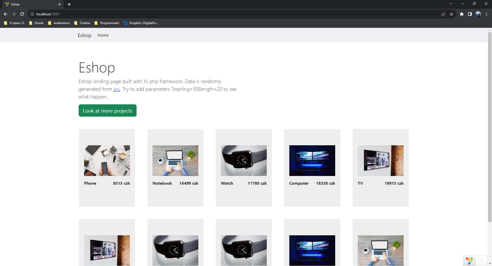

# Eshop-Yii

## About

PHP eshop built with framework Yii and connected to [backend](https://github.com/matousek11/eshop-controller) also in PHP.

## How to run

1. Open [backend](https://github.com/matousek11/eshop-controller) folder.
2. Go through startup of [backend](https://github.com/matousek11/eshop-controller#how-to-run-eshop-controller).
3. Run `php yii serve --port=3000`.
